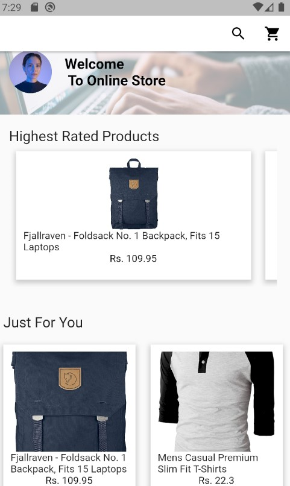
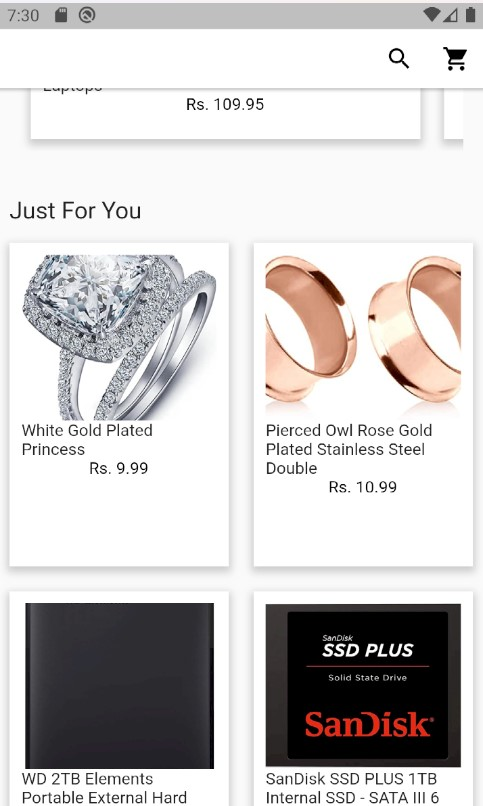

<h1> Online Store </h1>

<h4> Screen Shot of the product </h4>

<h5> Home Screen </h5>

<h5> Product Details </h5>

<h5> Search Product </h5>

<h1>Functionality of the project</h1>

 The E-commerce app allows the users to browse products through the app.  

 The application displays the all the product list that are fetched from the api. The app also displays the top 5 highest rated product 

 Users can Search through the product by typing the specific name of the product 

 Users can view the details of the product when they select a product in the product list 

<h1> Download link</h1>
[Title](build/app/outputs/flutter-apk/app-release.apk)
 